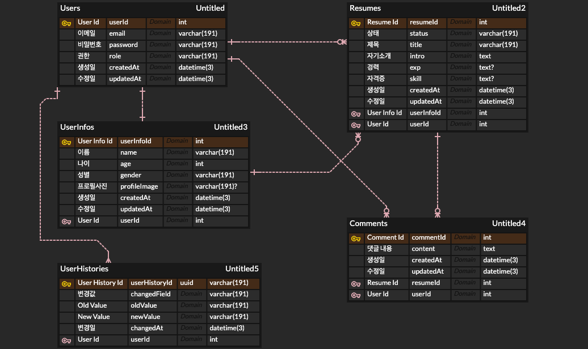
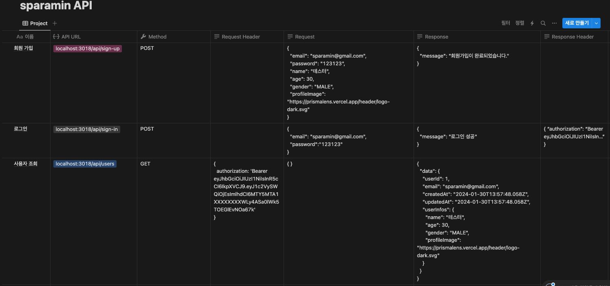
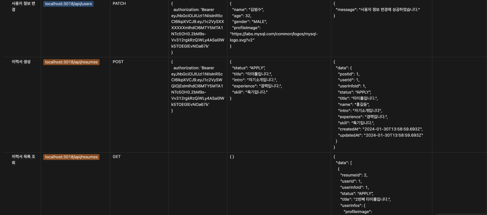
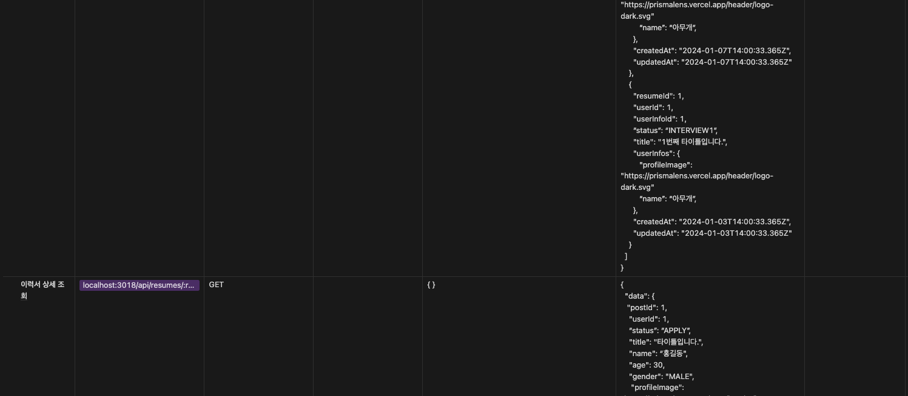
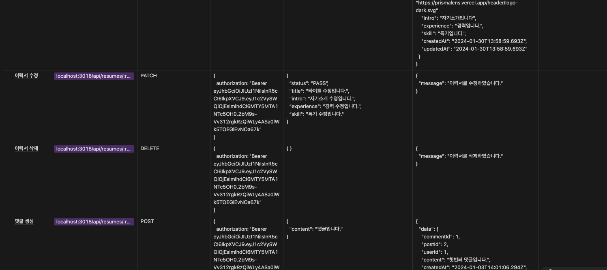
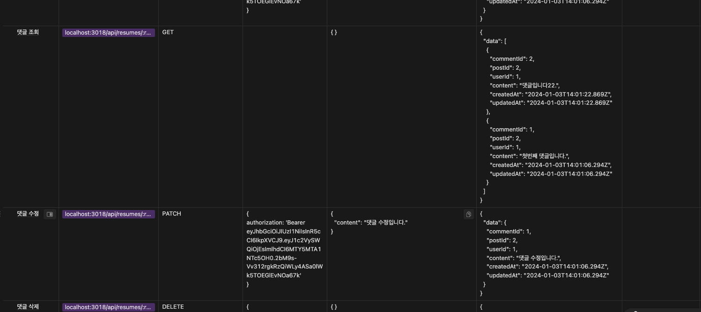

# sparamin

---

## ERD (feat. ERD Cloud)

(ref. schema.prisma)

## API Spec (feat. Notion)

(TBD: SwaggerHub API)

## 참고 사항

### 환경변수

- .env의 환경변수: DB_URL, JWT_SECRET

### API 명세서 URL

- https://mesquite-centaur-cbe.notion.site/76a4e05875be461f9c050c8079585c9a?v=25b2c932cc0c49ec990d9813045b9cae

### ERD URL

- https://www.erdcloud.com/d/4Fmc2xgfuAgDuxmSN

## 개발 노트

1. **암호화 방식**

   - bcrypt모듈을 활용하여 비밀번호를 암호화 하였음. 해당 모듈은 비밀번호를 특정 문자열(Hash)로 변환하여 단방향 암호화를 함. 원래의 비밀번호는 복구할 수 없지만 입력된 비밀번호가 암호화된 문자열과 일치하는지 비교 가능하여 검증할 수 있게 되는 것 (예시 참조):

   import bcrypt from 'bcrypt';

   const password = 'Sparta'; // 사용자의 비밀번호
   const saltRounds = 10; // salt를 얼마나 복잡하게 만들지 결정합니다.

   // 'hashedPassword'는 암호화된 비밀번호 입니다.
   const hashedPassword = await bcrypt.hash(password, saltRounds);

   console.log(hashedPassword);
   //$2b$10$OOziCKNP/dH1jd.Wvc3JluZVm7H8WXR8oUmxUQ/cfdizQOLjCXoXa

   - 이로써 평문으로 저장된 비밀번호 대비 보안에 좀 더 개선이 생김.

2. **인증 방식**

   - JWT(Json Web Token)을 이용해 인증 기능을 구현함. Access Token이 노출되었을 경우 해당 토큰이 탈취되어 여러 이슈가 생길 수 있음. 예를 들어 해당 사용자의 개인정보 유출이나 사용자의 권한으로 서비스에 접근할 수 있어 금전적 피해도 발생할 수 있음.
   - 이를 방지하기 위해 Access Token의 유효기간을 짧게 가져가고(3시간), Refresh Token의 유효기간을 상대적으로 길게(7일) 하여 Access Token을 재발급하도록 구현함.

3. **인증과 인가**

   - 인증은 서비스를 사용하려는 사용자가 인증된 신분을 가진 사람이 맞는지 검증하는 작업을 뜻함. 일반적으로, 신분증 검사 작업에 해당.
   - 인가는 이미 인증된 사용자가 특정 리소스에 접근하거나 특정 작업을 수행할 수 있는 권한이 있는지를 검증하는 작업을 뜻함. 놀이공원에서 자유 이용권을 소지하고있는지 확인하는 단계라고 보면 좋음.
   - 본 프로젝트에서 구현한 미들웨어는 인증에 해당함. 사용자의 토큰을 검증하여 해당 사용자를 식별하고, 그에 따른 권한을 설정하는 역할을 수행함.

4. **Http Status Code**

   - 201 Created: 리소스 생성 성공
   - 200 OK: 성공적인 요청 처리
   - 401 Unauthorized: 인증 실패
   - 404 Not Found: 리소스가 존재하지 않음
   - 409 Conflict: 리소스 충돌 또는 중복 (이메일 중복 등)
   - 500 Internal Server Error: 서버 오류

5. **리팩토링**

   - 이번 프로젝트에선 MySQL, Prisma로 개발했는데 이전 프로젝트에서 사용한 몽구스와 비교시 모델링 양식에서 큰 차이를 느낌. 프리즈마는 어느정도 SQL쿼리문과 비슷하게 모델링을 할 수 있다고 느꼈으나, 몽구스의 경우 각 데이터를 객체형태로 담도록 구현하다보니 다소 비정형적이라 느낌.
   - 그럼에도 불구하고, 어찌되었건 데이터란 필드와 타입의 명시만 간결하고 확실하다면 어떤 DB를 사용하든 코드 변경에 용이할 것 같은 원론적인 깨달음을 얻음. 또한, DB변경시 ORM에 의존하는 부분이 가장 크게 변경될 것으로 사료되어 그런 부분은 최대한 분리하여 코드를 작성하는 것이 유지 보수에 용이할 것 같음.

6. **API 명세서**
   - Swagger를 사용하면 API 명세서를 자동으로 생성할 수 있고, 인터랙티브하게 API를 테스트할 수 있음. 협업 시 API 명세서를 보다 효과적으로 공유하고 관리할 수 있음.
